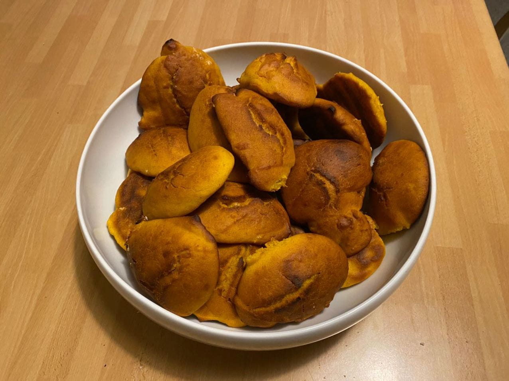
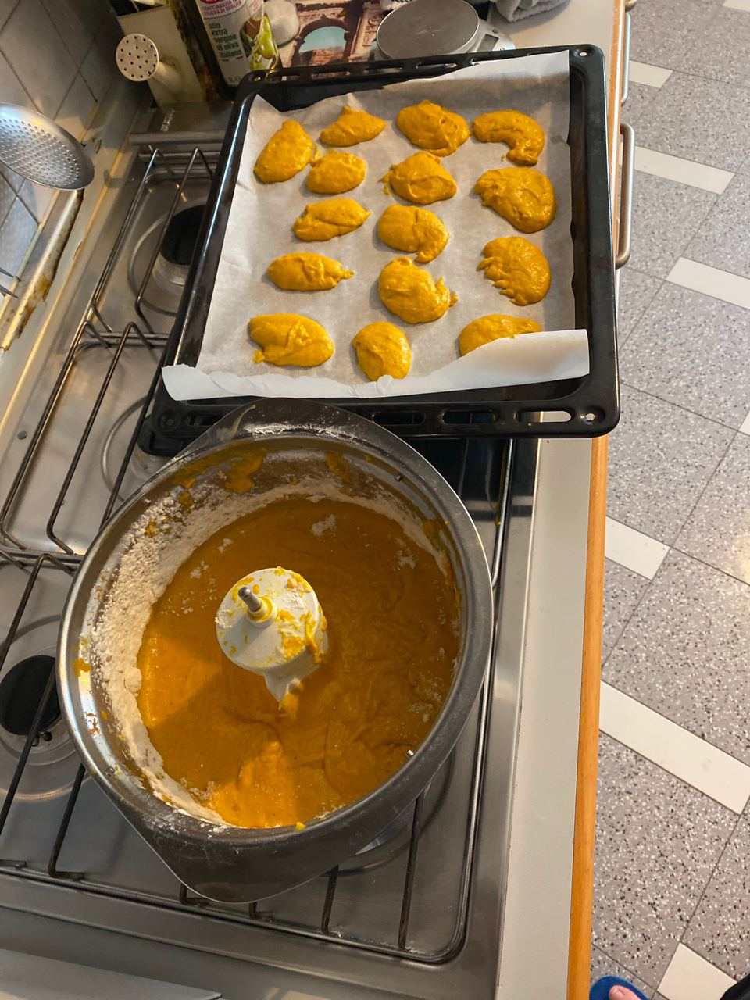
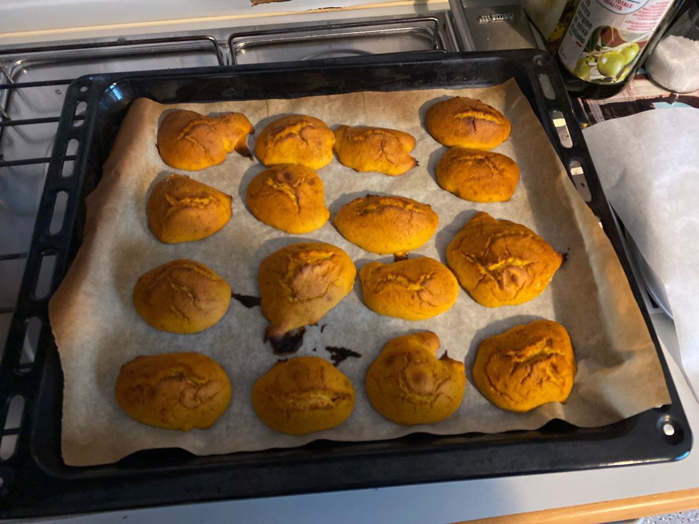

And now it is Autumn, or Fall if you are in the New Continent, but it is everywhere is Pumkin season. 
And it is my favorite Autumn's fruit[^1] and I eat it in any way. And some time I make it for eating it with a good cup of tea. 

So in this post I make a recipe for the "Witch's Bread", a family recipe for pumkin tea cake.

For start you need to have:

* 900g of boiled pumkin[^2] only the inside of the pumkin
* 800g of flour 00 
* 300g of butter
* 200g of Amaretti (the biscuit)
* 3 eggs
* 20g of baker powder 

Break the amaretti in a powder or little pieces.

In a large bow combine pumking, baker power, flour and the butter mixing them as long as they become one uniform compost.
After this you add the eggs and the Amaretti powder.

Mix all as long as they become somthing like a ice cream like in the photo.

Put this compost on a baking sheet with a spoon for making the bread. 

Bake at 200° C for 10 minutes or until golden brown. The outside must be hard and the inside soft. 
This is an example of them.

If them are more brown remove them.

For them I suggest or:

* A strong black tea.
* A spicy tea like a cinnamon or someting similar.

For better use of them I suggest to eat them with friends when on break or at the tea time.

Can cause dependency.

Good October for every one.

[^1]: [Wikipedia](https://en.wikipedia.org/wiki/Pumpkin) say it is a fruit, not me
[^2]: I make it with the pressure cooker, 10 minutes for the pressure cooker to come to pressure. 
