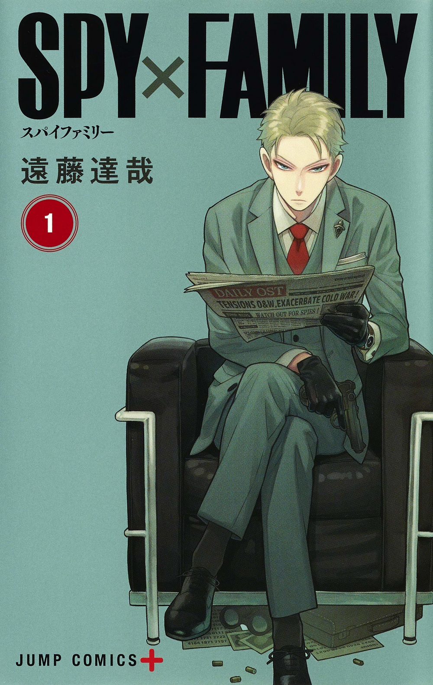
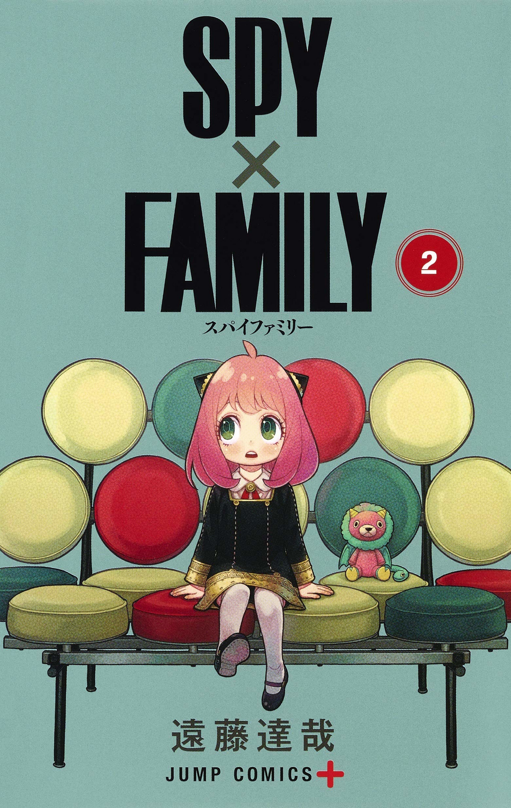
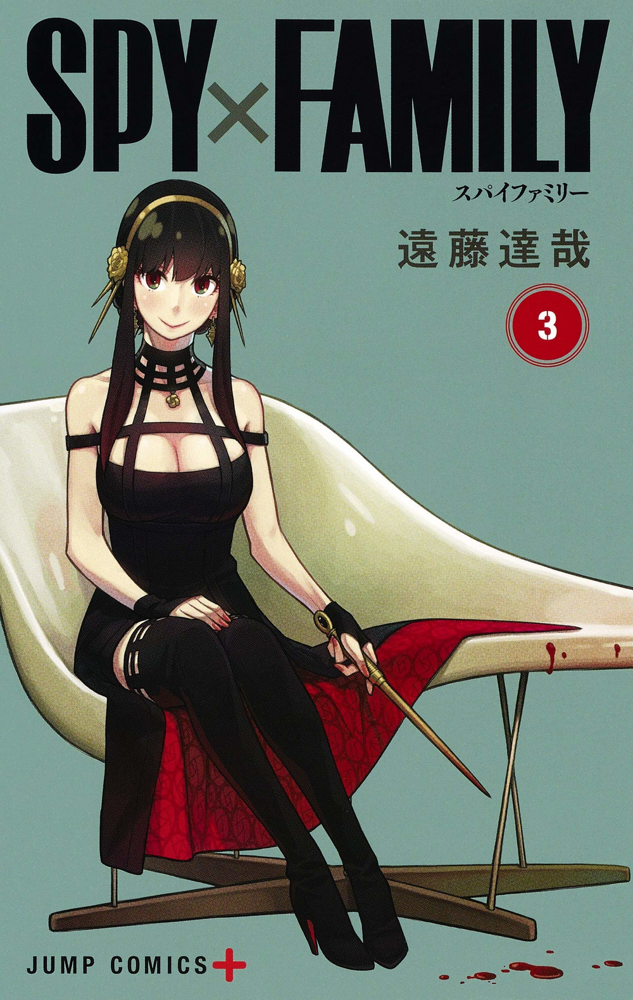
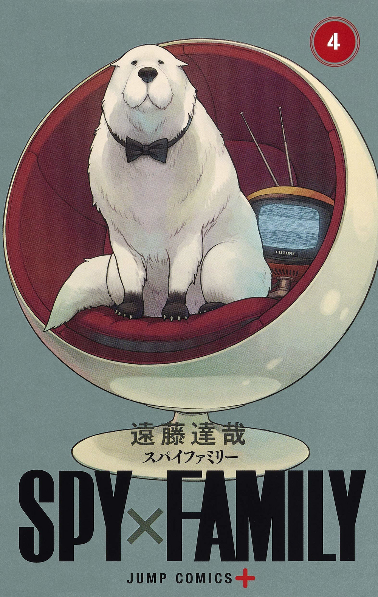
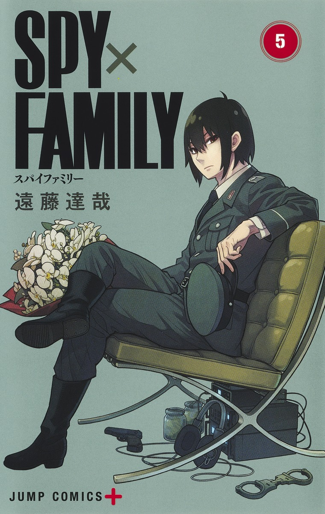
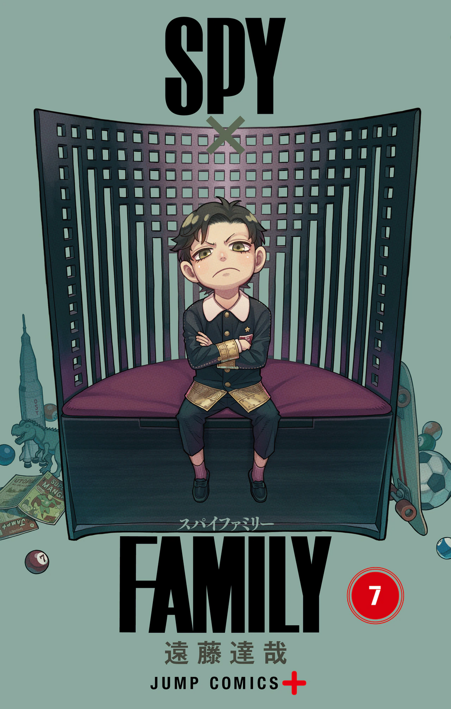
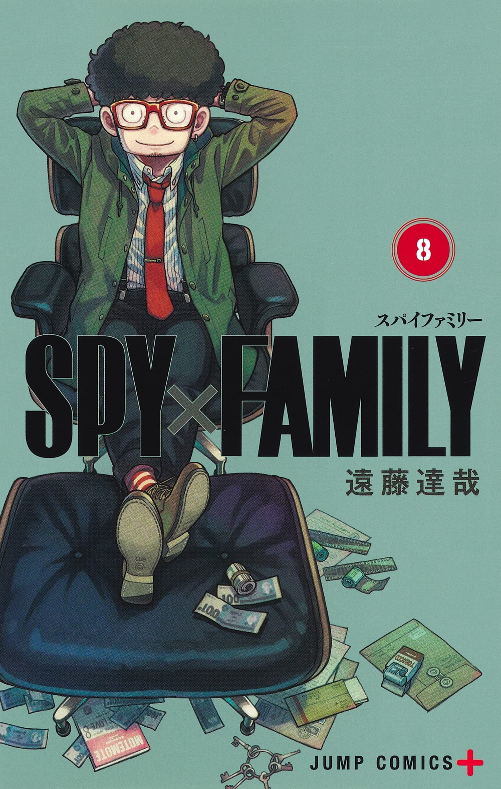
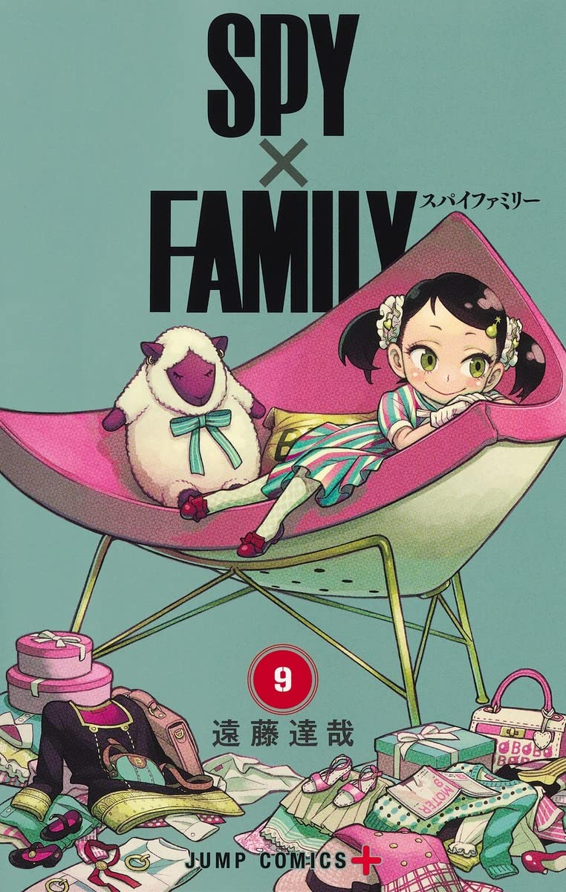

Ci sono delle caratteristiche dei manga che sono trasversali a tutti indipendentemente dal genere e dall’editore: la lettura da destra a sinistra, la carta estremamente economica, il disegno in bianco e nero e la copertina a colori con uno o più dei protagonisti sopra. In questo caso ci fissiamo sulle copertine.
Solitamente non mi sono mai interessato a perché un personaggio è in copertina ma diventando sempre più vecchio e puntiglioso ho iniziato a cercare di capire perché questo specifico personaggio o un gruppo di personaggi è in copertina.

La risposta è stata facile da trovare: solitamente questo avviene perché sono personaggi importanti per il volume di cui sono copertina o perché vengono introdotti in quel specifico volume.
Bisogna anche notare che i personaggi in copertina dei manga sono sempre con degli “attributi” specifici per il momento della storia: una pelliccia, una ferita, un abito, una macchia che identifica o aiuta a identificare il momento della storia da cui è preso quel particolare ritratto del personaggio.

Per questo quando ho visto la prima copertina di Spy x Family mi sono stupito: segue solo parzialmente questo schema. La copertina non ritrae la persona in un pezzo specifico del volume ma da la sensazione che la copertina sia una foto fatta in una studio fotografico

## Spy x Family

Per chi è rimasto sotto un sasso nell’ultimo periodo Spy x Family è un manga scritto e disegnato da \[Tatsuya Endo\]([https://it.wikipedia.org/wiki/Tatsuya_Endo](https://it.wikipedia.org/wiki/Tatsuya_Endo "https://it.wikipedia.org/wiki/Tatsuya_Endo")) che parla di una spia Twilight che deve prevenire la guerra tra due nazioni e per farlo deve scoprire i piani del “nemico” ovvero di Donovan Desmond. Per farlo però deve avvicinarlo e apparentemente l’ unico modo è costruire una falsa famiglia e avvicinare il figlio di Desmond.

Nasce così la famiglia Forger (gioco di parole sul termine inglese forger-falsario) composta da Loid/Twilight il padre, Yor la madre (assassina) e Anya la figlia (orfana e con la capacità di leggere nel pensiero) tenuta assieme dal desiderio di far funzionare questa famiglia ma per motivazioni uniche per ogni personaggio.

Oltre che la particolare trama a metà tra un triller e un spezzato di vita di una famiglia in un periodo storico molto probabilmente ispirato al periodo tra le due guerre mondiali con alcune influenze della guerra fredda, l’ altra particolarità del manga sono le copertine dei volumi.

## Le copertine

Le copertine dei volumi sono tutte costruite nello stesso modo: il protagonista è seduto su una sedia che lo definisce, solitamente con un oggetto rilevante per il personaggio, su questo sfondo monocromo verde petrolio. La sedia/poltrona su cui sono seduti i personaggi sono sempre allineate con il carattere del personaggio seduto sopra ed è quasi possibile leggere un ritratto psicologico del personaggio dalla copertina.

### Volume 1 Loid Forger - Le Corbusier LC2

 Il primo personaggio della storia e protagonista maschile. Sotto la poltrona ha la attrezzatura da spia messa li mentre il giornale introduce il problema ovvero la tensione tra i due stati che possono far partire la guerra. La poltrona su cui è seduto è la Le Corbusier LC2, una poltrona professionale molto famosa.

Questa specifica poltrona da un senso di eleganza e professionalità che vengono riprese sia dalla posa del personaggio che dal suo modo di vestire.

### Volume 2 Anya Forger - Divano Marshmallow

Alla figlia Anya viene dedicata la seconda copertina con il divano Marshmallow di George Nelson.

Nelson è diventato famoso per il concetto di "family room" che viene espresso particolarmente bene con questo divano. Questo fattore, oltre ai colori particolarmente giocosi del mobile, descrivono estremamente bene la piccola Anya, collante della famiglia e spruzzo di colori vivaci rispetto ai due genitori, che sono rappresentati sempre più posati e con meno colori rispetto alla bimba.

### Volume 3 Yor Forger - La Chaise

Madre di famiglia di giorno, assassina di notte, è un personaggio elegante ed estremamente specializzato. È uno specialista del suo lavoro anche se nel resto delle cose della vita di tutti i giorni è in difficoltà.

La poltrona La Chaise su cui siede è una poltrona molto elegante, quasi "specializzata" nel suo look che richiede di avere un ambiente dedicato e strutturato per poter dare il massimo.

In oltre sia Yor che la poltrona hanno una figura basata sulle loro curve che vengono ancora di più sottolineate dalla scelta cromatica, tutto per richiamare la professione da assassina di Yor.

### Volume 4 Bond - La Poltrona Ball

La quarta copertina ritrae l'ultimo componente dei Forger: Bond il cane.

La scelta per la poltrona di Bond non è cosi immediata come concetto ma, una volta compreso, è esemplare della dedizione avuta per le copertine.

La poltrona di Bond altro non è che la Poltrona Ball (o Ball Chair) di Eero Aarnio panna (richiamo a Bond stesso) di fuori e rossa dentro. La poltrona in questo caso viene vista e strutturata come la "cuccia" per Bound in cui lui sta elegantemente come tutti gli altri componenti della famiglia Forger.

Vorrei far notare anche la presente di una televisione sferica (come la poltrona) che altro non è che un riferimento all'origine del nome del personaggio nella serie (Bond è un nome preso dalla serie televisiva preferita dalla piccola Anya).

### Volume 5 Yuri - La poltrona Barcellona

Molto interessante l'utilizzo della poltrona di Yuri, il fratello di Yor che lavora nel controspionaggio, come panchina, dove il protagonista è seduto in attesa diviso tra il suo lavoro (rappresentati dalla sua uniforme e dall atrezzatura sotto la sedia) e l'amore della sorella (il mazzo di fiori che tiene in mano).

La poltrona, la Barcellona Chair di Ludwig Mies van der Rohe e Lilly Reich è una poltrona elegante dalla linea semplice al tempo stesso. Piccola curiosità sempre in linea con il carattere del personaggio la poltrona è stata definita come "Degna di un re", cosa che richiama parte della personalità di Yor.

### Volume 6 Fiona - Poltrona Heart Cone

La copertina di Fiona mostra subito due cose: il riferimento a Loid (nella posa e nell' arma) e il riferimento alla sua posizione di secondo possibile interesse romantico (nella poltrona e nei regali da San Valentino presenti sotto la poltrona).

La poltrona Heart Cone di Verner Panton richiama anche alla solitudine del personaggio data dal fatto dalla seduta stressa e dal fatto che il cuore abbraccia il personaggio quasi a voler consolare la sua espressione fredda ma triste, quasi a rimpiangere qualcosa.

### Volume 7 Damian - Sedia Willow

La sedia Willow di Charles Rennie Mackintosh fa in realtà parte di un set di interni: il Willow Tearoom di Glasgow. La sedia richiama questo senso di regalità e importanza, accentuati anche dall'espressione del personaggio, che cerca di darsi importanza anche se bambino.

Divertente anche che il personaggio è fuori misura rispetto al sedia, che poi è rappresentato enormemente nel comportamento di Damian nella storia, in cui cerca di essere più grande anche se, come tutti i bambini, non ha ancora trovato un suo spazio nel mondo.

### Volume 8 Franky - Poltrona Eames Lounge

Altra poltrona di Charles and Ray, la potrona di Franky è un sempreverde. La poltrona Eames Lounge è un pezzo che, come Franky, sta bene ovunque e non stonano in nessuno ambiente.

Il personaggio di Franklin è lo stereotipo della spalla della spia, che si camuffa in mille modi per dare aiuto alla spia e, come la poltrona, si adatta all’ambiente del momento.

### Volume 9 Becky - Poltrona Coconut Lounge

La poltrona Coconut Lounge di George Nelson è un pezzo di noce di cocco dove puoi sederti come vuoi.

Questo avviene perchè la poltrona non ha ne lo schienale ne i braccioli quindi puoi approfittare dello spazio come preferisci.

A questo si aggiunge il fatto che Becky, come Damian, è una bambina in uno spazio più grande di quello che ha realmente necessità. Ma a differenza di Damian il personaggio è a suo agio nella poltrona tanto che ha portato le sue cose e rende la poltrona quasi una tana.

## Speranze per il futuro

Questi sono per ora i volumi usciti. Online gira la copertina del 10 volume che non affronto nell articolo per due ragioni: non ha una poltrona/sedia di design e per spiegarla dovrei spiegare mezzo volume, cosa che sono contrario a fare (andate a leggerlo piuttosto) ma spero che i volumi successivi continuino questa collezione di copertine verde petrolio con questi stupende metafore sui personaggi attraverso oggetti di arredo e design. Se continuano con questo ritmo di pubblicazioni probabilmente, a questo articolo, ci sarà un seguito.
